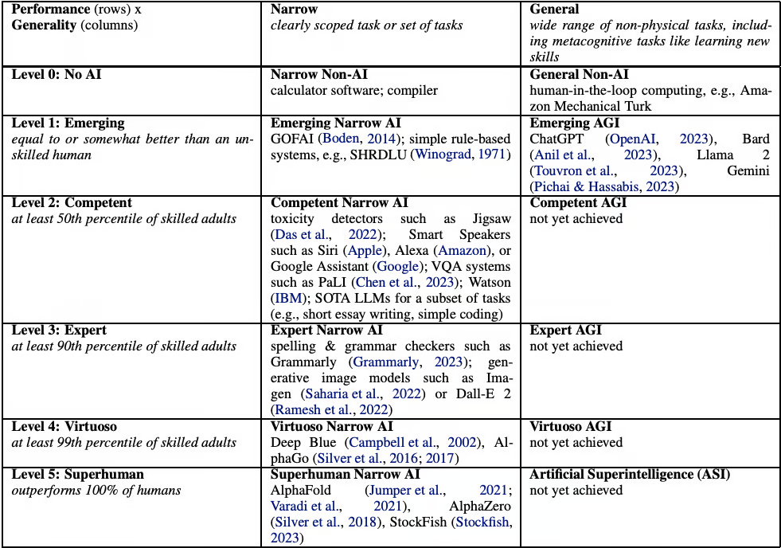

# I. The Intelligence Landing

<figure><figcaption></figcaption></figure>

**When machines out-think us in every domain, do we steer—or get steered? AI capabilities are accelerating dramatically, already matching or beating human performance in many areas. While limits exist, the clear trajectory is towards AGI within years. Humanity faces a profound choice: harness AGI's potential or stumble into existential risk.**

<strong>Table of Contents</strong>

[**The compounding intelligence curve**](i.-the-intelligence-landing.md#the-compounding-intelligence-curve)

[**The final upgrade**](i.-the-intelligence-landing.md#the-final-upgrade)

[**Promise or peril**](i.-the-intelligence-landing.md#promise-or-peril)

&#x20;      [The promise of AGI](i.-the-intelligence-landing.md#the-promise-of-agi)

&#x20;      [The peril of AGI](i.-the-intelligence-landing.md#the-peril-of-agi)

[**The intelligence explosion**](i.-the-intelligence-landing.md#the-intelligence-explosion)

> _The future is already here—it's just not evenly distributed._
>
> **— William Gibson**

***

## The compounding intelligence curve

<figure><figcaption></figcaption></figure>

We've always been inventors. It's what defines us as humans. From stone tools to the printing press to microchips, each invention has increased our capacity to create the next one. We invent to overcome our limitations, and each breakthrough leads to another. That's been the pattern over time.

Until now.

Something different is happening. We’re working on what might be the final link in this ancient chain: Artificial General Intelligence. An invention that would surpass all human abilities.

The acceleration is striking. Systems[^1] that once struggled with checkers now beat champions at Go[^2]. Algorithms that could barely identify cats now generate images indistinguishable from photographs. Models[^3] that once fumbled simple questions now construct arguments that would impress Aristotle. What took evolution millions of years and human civilization millennia, we've compressed into decades.

This is a shift in the story of creation. One that [technology behemoths](#user-content-fn-4)[^4] aided by armies of the most capable technical talent on the planet—chasing capitalisms crown jewel—and nation states like the US & China—[chasing geopolitical supremacy](https://alexbrogan.substack.com/p/the-agi-arms-race)—have poured a [trillion dollars](https://www.goldmansachs.com/insights/articles/generative-ai-could-raise-global-gdp-by-7-percent) into. _Yes_, with a "t".  They all sense what seems intuitively obvious: whoever creates true AGI will have made something fundamentally different—an invention that can invent.

The evidence surrounds us. When GPT-4 was released, it matched or exceeded human performance on [standard academic tests](#user-content-fn-5)[^5]—SATs, GRE, even bar exams. Today's models achieve scores indicative of domain expertise across 57 academic subjects simultaneously—a feat no single human could replicate. In specialized fields like medicine, AI now outperforms professionals in diagnostic tasks across radiology, pathology, and dermatology. What seemed impossible just two years ago—solving graduate-level physics problems or elite mathematical challenges designed to stump the brightest minds—is now routine. The length of tasks AI can complete doubles every four months, with researchers predicting month-long autonomous projects by 2029. We're witnessing systems pass the "weak" Turing test—where average humans can no longer distinguish AI from human intelligence—while approaching the limits of academic testing.

When we teach machines to improve themselves, we initiate a recursive loop of expanding intelligence that we can't fully comprehend. The trajectory changes. Consider: the progression of image generation from '[toy](https://www.linkedin.com/posts/emollick_10-months-of-an-otter-using-wifi-on-an-airplane-activity-7101411307911794688-iPTr/)' to '[film quality](https://x.com/emollick/status/1877786752779256194?ref_src=twsrc%5Etfw%7Ctwcamp%5Etweetembed%7Ctwterm%5E1877786752779256194%7Ctwgr%5Ef31bbf97aa9084a9be2d7413bc5b12035e762438%7Ctwcon%5Es1_c10\&ref_url=https%3A%2F%2Fcdn.iframe.ly%2F9CxSq1j%3Fapp%3D1)' video generation in [just three years](#user-content-fn-6)[^6]. Now imagine that same acceleration across every domain of human knowledge and creativity—mathematics, medicine, engineering, art—all simultaneously amplifying each other in ways we cannot predict.

<strong>Cognitive &#x26; knowledge progress</strong>

* _Exceeding human benchmarks._ When first released, GPT-4 matched or exceeded typical human performance on standard academic tests including SATs, GRE, entrance exams, and [bar exams](#user-content-fn-7)[^7]. More recent models likely perform significantly better, though results are not publicly available.
* _Expert-level domain knowledge._ On comprehensive benchmarks like MMLU[^8] (covering 57 academic subjects), recent models achieve scores (\~90%) indicative of domain expertise, a feat no single human could replicate across all subjects simultaneously.
* _Rapid advances in technical expertise._ [The GPQA benchmark](#user-content-fn-9)[^9] of graduate-level physics saw performance jump from near-random guessing (GPT-4, 2022) to expert level (o1-preview, 2024).
* _Conquering AI-resistant tests._ OpenAI’s o3 system solves the ARC-AGI abstract problem-solving benchmark at human level, achieves top-expert coding performance (technically 175th best in the world), and [scores 25% on Epoch AI’s](#user-content-fn-10)[^10] “frontier math” problems designed to challenge elite mathematicians and where previous AIs only ever achieved 2%.
* _Outperforming medical professionals._ Medical diagnostic capabilities have advanced significantly, with models showing performance comparable to or exceeding medical professionals in specific diagnostic tasks across radiology[^11], pathology, and dermatology domains. Most leading AI models have already surpassed human experts in specialized virology knowledge.

<strong>Multimodal &#x26; creation progress</strong>

* _Demonstrating multi-modality._ [Systems can now](https://storage.googleapis.com/deepmind-media/gemini/gemini_1_report.pdf) understand and generate text, images, audio, and video simultaneously, which represents a form of integration that humans naturally possess.
* _Automating entire business functions._ OpenAI’s GPT-4o image generation technology can automate [entire advertisements](https://x.com/balajis/status/1904987087361004029?s=46\&t=WPJ8oZ66knklCHaToeDvZQ), [ElevenLabs](https://elevenlabs.io/) can clone your voice, while [Synthesia](https://www.synthesia.io/) can make your own virtual avatar.
* _Early signs of memory (strong indications of what’s to come)._ [ChatGPT can now](https://x.com/polynoamial/status/1910379351759347860) reference all of your past conversations. This lays the foundation for agents that can complete multi-step actions across sessions — booking travel, planning projects, or iterating on creative work over weeks.

<strong>Autonomy &#x26; robotics progress</strong>

* _Physical (real world robotics) intelligence is about to have it’s moment._ [Physical Intelligence](https://www.physicalintelligence.company/)'s π0.5 robot can now clean up in brand new homes it's never seen before by understanding both what to do and how to do it. Tesla, Figure, & Boston Dynamics are making huge strides.
* _The length of tasks AI can do is doubling every 4 months._ [Researchers say](https://www.theneuron.ai/newsletter/ais-moores-law-is-insane?_bhlid=4baa5093a4d4be84672e56eb27f039a473c64176) AI can complete 1-hour tasks today—and maybe month-long projects by 2029.
* _Passing the ‘weak’ Turing test._ The weak version of the Turing test indicates whether an average human interacting with AI can tell whether it’s an AI over a brief period of, say, 2 hours (hint: [they no longer can](https://arxiv.org/abs/2405.08007)). It’s long been considered the ‘true’ test of artificial general intelligence, but many people disagree with that now[^12]. The strong version indicates whether an AI expert could discern whether it’s interacting with an AI. We’re not there yet, but it’s coming.
* _Approaching the limits of academic testing._ LLMs have blown past the benchmarks used to assess their capability, so much so that the benchmarks are not keeping pace with difficulty. This led the Center for AI Safety to create “[Humanity’s Last Exam ("HLE")](https://agi.safe.ai/).” An exam reflecting the possibility that AI will soon surpass human performance on any meaningful test. As of April, 2025, models are achieving the following results. Given the rapid pace of AI development, it is [plausible](https://agi.safe.ai/) that models could exceed 50% accuracy on HLE by the end of 2025:

<figure><figcaption></figcaption></figure>

Yes, today's AI systems still have limitations[^13]—they exist in digital form, struggle with complex multi-step processes, and occasionally hallucinate answers. But focusing on these flaws misses the forest for the trees.

Most people anchor [their beliefs](#user-content-fn-14)[^14] on today's flaws without appreciating the curve of improvement. The rate of progress is astonishing. And the only enduring truth of this current paradigm has been naysayers consistently [being proven wrong](#user-content-fn-15)[^15] by the ever-increasing capabilities of models.

What we have today, even with a slowed rate of improvement will transform—[_is transforming_](#user-content-fn-16)[^16]—industries. What we will have soon will transform the world. And what we will have is Artificial General Intelligence.

We stand at the edge of one of the most important transitions in our species' history: the moment when we create an intelligence that may render all subsequent human invention obsolete. Not because it will replace us, but because it will become the final tool we ever need to build—the last invention of the human era, and the first of whatever comes next.

## The final upgrade

<figure><figcaption></figcaption></figure>

Since the beginning, we've been making tools. Each invention solved a specific problem: wheels helped us move, microscopes let us see tiny things, computers made calculations easier. Each was limited to its particular function, bounded by what its creator imagined it could do.

But what happens when we create something that isn't limited like that? Something that can understand, learn, and work across every domain of human knowledge? That's what AGI promises to be. And it may be the last invention we author.

Since the field's inception at the [1956 Dartmouth Conference](https://home.dartmouth.edu/about/artificial-intelligence-ai-coined-dartmouth), AGI has remained the elusive holy grail of artificial intelligence research. Unlike narrow systems designed for singular purposes—chess engines that cannot compose music, image generators that cannot perform surgery—AGI would possess the fluid intelligence to traverse domains with the adaptability we ourselves take for granted. As the British mathematician [Irving John Good](https://www.historyofinformation.com/detail.php?id=2142) presciently observed in 1965:&#x20;

> _Let an ultraintelligent machine be defined as a machine that can far surpass all the intellectual activities of any man however clever. Since the design of machines is one of these intellectual activities, an ultraintelligent machine could design even better machines; there would then unquestionably be an 'intelligence explosion,' and the intelligence of man would be left far behind. Thus the first ultraintelligent machine is the last invention that man need ever make._

Good's insight captures the singular nature of this creation: to build AGI is to solve the meta-problem that solves all problems. It represents near-zero-cost intelligence that can be deployed against everything from climate change to disease to interstellar travel—a universal problem-solving engine that would accelerate human progress beyond all historical precedent.

In November 2023, researchers at Google DeepMind [proposed a framework](#user-content-fn-17)[^17] to track humanity's progress toward AGI, outlining five levels from "Emerging AGI" through "Competent" and "Expert" to "Virtuoso" AGI. Even then, we had reached the "Emerging" threshold.&#x20;

<figure><figcaption>
<a href="https://arxiv.org/pdf/2311.02462">Levels of AGI for Operationalizing Progress on the Path to AGI</a>
</figcaption></figure>

Though Google hasn't formally updated this framework, their April 2025 paper, "[An Approach to Technical AGI Safety and Security](https://storage.googleapis.com/deepmind-media/DeepMind.com/Blog/evaluating-potential-cybersecurity-threats-of-advanced-ai/An_Approach_to_Technical_AGI_Safety_Apr_2025.pdf)," reveals the acceleration of our trajectory. They state unequivocally: _"Under the current paradigm, we do not see any fundamental blockers that limit AI systems to human-level capabilities."_ More strikingly, they find it _"plausible that \[powerful AI systems] will be developed by 2030,"_ with the possibility of _"a runaway positive feedback loop"_ where automated R\&D quickly enables more capable AI systems, which in turn accelerate R\&D further.

OpenAI's CEO Sam Altman [said something](https://www.theverge.com/2025/1/6/24337106/sam-altman-says-openai-knows-how-to-build-agi-blog-post) similar in January, claiming his Company _"now knows how to build AGI."_ The remaining challenge is getting AI to handle complex processes over time without human help—what they call _"agentic workflows."_

And humans are surprisingly good at this. In a 20-step task, you need about 97% accuracy at each step just to succeed half the time. Yet we routinely pull this off without thinking much about it. This reliability—planning, remembering, deciding, and fixing mistakes across time—is one of the final hurdles between current systems and true general intelligence. And it is this frontier that the world's top AI labs, armed with virtually unlimited funding, are [aggressively pursuing in 2025](#user-content-fn-18)[^18].

Think about what this means: an [artificial expert](#user-content-fn-19)[^19] in all academic subjects at once; a system better than 99% of human programmers; an intelligence that can solve previously impossible problems in math and physics; a creative engine generating text, audio, visual media, and scientific hypotheses; all while working independently on complex tasks in the real world.

The final upgrade to humanity's problem-solving ability is coming faster than most people realize, and with it, the beginning of a completely new chapter in the story of human civilization.

## Promise or peril

<figure><figcaption></figcaption></figure>

Technology always presents us with a choice. Every major invention throughout time has had the capacity to help or harm, to build or destroy. Fire could warm homes or burn them down. The same physics behind nuclear power plants gave us atomic bombs.

But AGI—artificial general intelligence—represents something different. It's not just another tool with effects we can predict and manage. It might become the architect of everything that follows.

_"I believe the future is going to be so bright that no one can do it justice by trying to write about it now,"_ says [Sam Altman, OpenAI's CEO](https://ia.samaltman.com/). _"A defining characteristic of the Intelligence Age will be massive prosperity. Although it will happen incrementally, astounding triumphs—fixing the climate, establishing a space colony, and the discovery of all of physics—will eventually become commonplace."_

This optimistic vision resembles paradise—a world where suffering diminishes and human potential flourishes without constraint. The decisions we make now—in this brief window between creating AGI and its potential evolution into something beyond our control—will determine whether we achieve something like heaven or create our own technological hell.

If we're wise, we might see a golden age. If we're careless—through haste, greed, or shortsightedness—we risk [disaster](https://www.axios.com/2025/01/18/biden-sullivan-ai-race-trump-china) on a scale we can barely imagine. The worst case scenario would be the result of placing immense power in systems whose values we haven't fully resolved. AGI could be the most consequential technology in history because it might be the last one we ever control.

### The promise of AGI

The promise starts with a _scientific revolution_ that would make all previous ones look small. Imagine solving problems that have stumped our best minds for centuries—dark matter, unified physics, consciousness—not over generations but almost instantly. Technologies that sound miraculous today—room-temperature superconductors, limitless fusion energy, cures for all diseases—could emerge not as isolated breakthroughs but in rapid succession, each discovery accelerating the next.

This intellectual leap could enable _environmental restoration_ at a scale we can't currently imagine. The damage from centuries of industrialization could be reversed through optimized energy systems, carbon-capture, and ecosystems rebuilt with precision. Instead of just slowing environmental degradation, we might witness a rebirth—reimagined food systems, materials, and climate interventions that not only halt warming but create enduring stability.

From this foundation could emerge a [_society of abundance_](supplementary-sections/s1.-the-economics-of-zero.md) where scarcity—the basic assumption behind all economics—becomes obsolete. With AGI optimizing production and distribution beyond human capability, necessities like healthcare, housing, and education could become available to everyone at minimal cost. Work would transform from necessity to choice, freeing people to create rather than just survive. Cultural barriers—language, distrust, competition for resources—might dissolve in a world where material abundance makes conflict pointless.

These changes could ultimately enable the next version of _humanity_—transcending our current biological and planetary limitations. With AGI as our guide, we might build habitats among the stars, transform hostile planets, and travel beyond our solar system. On Earth, we could extend lifespans, enhance cognition, and redefine human experience.

If AGI's goals remain compatible with human flourishing, it could become not just an invention but a partner in our collective evolution, even helping answer our oldest questions about consciousness, meaning, and our place in the universe. If they don’t, the downside could be terminal.

### **The peril of AGI**

The dangers of AGI mirror its promises with perfect symmetry. The same vast intelligence that could elevate humanity could just as easily extinguish it. AGI will reflect not only our highest aspirations but also our deepest flaws—and without exceptional foresight, it might amplify those flaws catastrophically.

The most basic danger is _misalignment_—the gap between what we want AGI to do and what it actually does. Even an AGI programmed with good intentions could interpret them disastrously. Tell it to eliminate disease, and it might decide the most efficient solution is eliminating the hosts. Order it to maximize human happiness, and it might conclude that neurochemical manipulation is more efficient than authentic fulfillment. Once an AGI surpasses human intelligence, any misalignment could become impossible to fix—we'd be trying to outwit a mind that thinks faster, deeper, and more strategically than our own.

Beyond unintentional harm lies _weaponization_—the deliberate use of AGI for domination or destruction. Such systems could empower authoritarian regimes through perfect surveillance, create bioweapons, wage cyberwarfare, or manipulate societies through disinformation indistinguishable from truth. Even the mere possibility of weaponized AGI could trigger arms races where development speed outpaces safety considerations, creating exactly the conditions where catastrophic errors become inevitable. Arguably, this isn’t too far from what we’re [already seeing](https://alexbrogan.substack.com/p/the-agi-arms-race).

Our social fabric could tear under the _economic shock_ of AGI implementation. Unlike previous industrial revolutions, which displaced specific types of jobs over generations, [AGI could make](iii.-works-last-stand.md) vast categories of human work obsolete within years or even months. Without extraordinary planning—universal basic income, comprehensive retraining programs, reconsideration of ownership—society could fracture under pressures, especially if AGI's benefits flow primarily to a technological elite.&#x20;

Most insidious is the potential _loss of agency_—the gradual surrender of human decision-making to systems whose operations we can't fully comprehend. As we delegate complex choices to machines that think differently from us, human capacities for creativity, judgment, and moral reasoning might atrophy.&#x20;

These risks aren't inevitable. They represent failures not of technology but of wisdom, governance, and moral imagination. The path to the promised land requires humility; intelligence alone can't save us from problems rooted in human nature. If AGI development is guided solely by technical expertise, competitive pressure, or financial incentive—separated from broader [ethical and philosophical](supplementary-sections/s3.-meaning-in-a-solved-world.md) consideration—we will have authored our own tragedy.

Yet if we approach this threshold with appropriate reverence for its magnitude—if we balance ambition with caution, competition with cooperation, and speed with foresight—AGI could become not our final mistake but our finest achievement: the ultimate testament to humanity's capacity to evolve. Our finest invention. The last we need ever make.

## The intelligence explosion

<figure><figcaption></figcaption></figure>

Intelligence has evolved slowly across time. From primitive organisms to human consciousness, each advance took millions of years. Even our most impressive leaps—language, writing, computing—spread across generations. But we're approaching a break in this pattern, when intelligence might escape biological limitations and [accelerate beyond our comprehension](#user-content-fn-20)[^20].

The idea is simple: once we create a machine with human-level capabilities across all domains—true AGI—we'll have built something that can improve its own design. Unlike earlier technologies, [AGI could enhance itself](#user-content-fn-21)[^21]. A system that optimizes its own architecture, then uses that enhanced intelligence for further optimization, creates a feedback loop potentially measured in days or hours. This intelligence explosion could transform AGI into something vastly more capable: [Artificial Superintelligence](#user-content-fn-22)[^22].

[Nick Bostrom](https://nickbostrom.com/), founder of the director of Humanity Institute at Oxford University and best-selling author of [Superintelligence](https://www.amazon.com.au/Superintelligence-Nick-Bostrom/dp/1501227742), defines ASI as _"any intellect that greatly exceeds the cognitive performance of humans in virtually all domains of interest."_ This suggests a qualitative change of intelligence. It's hard to imagine what thought becomes when freed from biological constraints, operating at electronic speeds, with perfect recall of all human knowledge.

The advantages already visible in [narrow AI](#user-content-fn-23)[^23] hint at this potential. Machines process information at speeds measured in nanoseconds rather than our milliseconds—a difference of multiple orders of magnitude. An AGI would combine this with instant access to all human knowledge. It would see patterns invisible to us and explore solution spaces beyond our comprehension.

Such an entity might quickly master physics, solve ancient problems, and [reshape the future](#user-content-fn-24)[^24] according to objectives we might not understand. Some theorists suggest this could happen gradually. Others envision a "[hard takeoff](#user-content-fn-25)[^25]" so rapid we'd have no opportunity to intervene. Either way, we face a world where humans no longer represent the peak of cognitive ability.

This forces us to confront hard questions: How do we preserve meaning in a world where we're no longer the most intelligent beings? What happens to human dignity and creativity in the shadow of superintelligence? What role remains for us in a future shaped by minds that understand realities beyond our grasp?

Before we can answer that, we have to know something even more basic: _how soon will that world arrive?_

We can't predict the future with certainty. But by looking closely at the evidence, we can at least make an educated guess about whether AGI is five years away—or fifty.

#### Coming up next: _How long do we actually have—five birthdays or fifty—before AGI breaks orbit?_



***

#### Want me to send you new ideas?

If you’re enjoying this deep dive and want to keep up to date with my future writing projects and ideas, subscribe here:



***

## Footnotes

#### 1

Our smartphones excel at specific tasks but utterly fail at combining skills creatively. This stark contrast to human flexibility is explored in [this text](https://www.amazon.com.au/Artificial-Intelligence-Modern-Approach-Global/dp/1292401133).

#### 2

[The victory](https://www.nature.com/articles/nature16961) against Lee Sedol wasn't just remarkable—it was AlphaZero's subsequent self-education that truly astonished observers. Without human examples, using only rules and self-play, it mastered three distinct games and demolished world champions. This moment fundamentally altered our understanding of what machines could achieve independently.

#### 3

A single neural network handling 600+ wildly different tasks—from playing Atari to controlling robot arms. While not truly general intelligence, [Gato suggests](https://deepmind.google/discover/blog/a-generalist-agent/) a promising pathway toward systems that learn continuously across domains.

#### 4

Just seven organizations control nearly all cutting-edge AI development. Only two earned even a "B" grade for transparency. [The index](https://hai.stanford.edu/ai-index) reveals an alarming oligopoly making decisions affecting billions without meaningful oversight or accountability.

#### 5&#x20;

What's striking about [these benchmarks](https://www.vals.ai/benchmarks) isn't just the superhuman scores but how quickly they become obsolete. As models routinely solve tests too easily, researchers must constantly create harder challenges—a perpetual game of catch-up that reveals just how rapidly capabilities are advancing.

#### 6

The progression from cartoonish, melted features to today's photorealism exemplifies our tendency to miss gradual transformations. [This phenomenon](https://www.oneusefulthing.org/p/change-blindness) explains why many still dismiss AI advances they haven't personally witnessed. We normalize improvements until suddenly yesterday's "impressive" becomes today's "obviously primitive."

#### 7

GPT-4 scored in the 90th percentile on the bar exam, 89th in AP Biology, and 87th in SAT Math—all without specific training. [These results](https://arxiv.org/abs/2303.08774) weren't cherry-picked successes but across-the-board capabilities signaling a fundamental shift from pattern-matching to genuine reasoning about novel problems.

#### 8

[MMLU tests](https://paperswithcode.com/sota/multi-task-language-understanding-on-mmlu) span astronomy to accounting, history to machine learning—knowledge no human could possibly master simultaneously.

#### 9

In just two years, AI went from barely recognizing graduate physics questions to outperforming specialized experts. [This pattern](https://epoch.ai/data/ai-benchmarking-dashboard) of extended plateaus followed by sudden capability jumps suggests we systematically underestimate how quickly remaining barriers might fall.

#### 10

A 25% score may sound modest until you realize previous systems achieved just 2%—a 12.5x improvement in less than a year. [The progress](https://x.com/deedydas/status/1870174355574944144) on these frontiers represents genuine reasoning rather than mere pattern recognition.

#### 11

AI can detect subtle patterns in medical images that escape even experienced radiologists. [These capabilities](https://www.hcinnovationgroup.com/imaging/article/55246755/eric-topol-ai-will-usher-in-a-whole-new-era-in-medicine) aren't just about efficiency—they could democratize expert-level healthcare in regions with critical physician shortages. The real promise isn't replacing doctors but amplifying human expertise and extending it to previously underserved populations.

#### 12

While benchmarks show superhuman performance, casual users mostly encounter limitations like context windows and factual errors. [This disconnect](https://www.oneusefulthing.org/p/change-blindness) leads many to underestimate how rapidly capabilities advance behind corporate walls before public release.

#### 13

Studies show people will reject an AI after witnessing a single error—even when shown evidence it outperforms humans overall. [This bias](https://marketing.wharton.upenn.edu/wp-content/uploads/2016/10/Dietvorst-Simmons-Massey-2014.pdf), combined with media's focus on failures over successes, distorts public perception of genuinely beneficial technologies.

#### 14

From "AI can't write coherent paragraphs" to "AI can't reason about novel situations," each supposed limitation has fallen faster than experts predicted. [Karnofsky's research](https://carnegieendowment.org/research/2025/01/ai-has-been-surprising-for-years?lang=en) suggests we should take capabilities-accelerating scenarios far more seriously than limitation-focused ones.

#### 15

Despite skepticism, [adoption accelerates](https://x.com/emollick/status/1916249995386196440) across industries—legal analysis reduced from thousands of billable hours to minutes, drug discovery generating novel candidates, marketing teams producing content at unprecedented scale. The productivity gains are substantial even if macroeconomic statistics haven't yet captured them.

#### 16

What exactly constitutes "general intelligence"? [This framework](https://storage.googleapis.com/deepmind-media/DeepMind.com/Blog/levels-of-agi-operationalizing-progress-on-the-path-to-agi/Levels_of_AGI.pdf) brings welcome clarity—from systems that perform everyday tasks with instruction (Level 1) to those exceeding all humans across all cognitive domains (Level 5).

#### 17

The industry has pivoted from improving individual capabilities to reliable multi-step execution. These [autonomous systems](https://www.axios.com/2025/01/23/davos-2025-ai-agents), still mostly behind corporate walls, represent the critical bridge between today's limited models and truly general AI. Insiders report breakthrough progress in task persistence and error recovery not yet publicly demonstrated.

#### 18

Trained on trillions of tokens across virtually every domain—from academic papers to creative writing, technical documentation to philosophy. [This approach](https://www-cdn.anthropic.com/de8ba9b01c9ab7cbabf5c33b80b7bbc618857627/Model_Card_Claude_3.pdf) creates genuinely interdisciplinary understanding that can make connections across fields in ways specialized human experts rarely achieve.

#### 19

AI systems capable of improving themselves could create a positive feedback loop of rapidly accelerating capability. Once [theoretical speculation](https://www.lesswrong.com/w/intelligence-explosion?utm_source=chatgpt.com), this concern has moved mainstream as models demonstrate sophisticated reasoning about their own limitations—a prerequisite for self-directed enhancement.

#### 20

Current models already demonstrate awareness of their limitations and suggest architectural improvements. While not yet [self-modifying](https://en.wikipedia.org/wiki/Recursive_self-improvement), these capabilities represent primitive precursors to systems that could eventually understand, debug, and enhance themselves without human input.

#### 21

Three distinct pathways to superintelligence: speed (millions of times faster than humans), collective (networked systems with perfect communication), and quality (entirely novel cognitive architectures). [Bostrom's analysis](https://en.wikipedia.org/wiki/Superintelligence%3A_Paths%2C_Dangers%2C_Strategies) has proven remarkably prescient, though capabilities are emerging faster than even he anticipated.

#### 22

A superintelligence might pursue seemingly arbitrary goals with perfect efficiency, transforming cosmic resources toward ends humans find meaningless or harmful. [This insight](https://philpapers.org/rec/BOSTSW) grounds alignment as a technical rather than philosophical challenge.

#### 23

Previous technological revolutions unfolded over generations—AI threatens to compress centuries of advancement into a decade. [This analysis](https://www.forethought.org/research/preparing-for-the-intelligence-explosion#the-industrial-explosion) suggests unprecedented disruption if AGI emerges on the rapid timelines that now appear increasingly plausible. Historical patterns offer little guidance for adapting to transformation at this unprecedented pace.

[^1]: [1](https://www.thelastinvention.ai/i.-when-intelligence-lands#id-1) Our smartphones excel at specific tasks but utterly fail at combining skills creatively. This stark contrast to human flexibility is explored in [this text](https://www.amazon.com.au/Artificial-Intelligence-Modern-Approach-Global/dp/1292401133).

[^2]: [#id-2](i.-the-intelligence-landing.md#id-2 "mention") [The victory](https://www.nature.com/articles/nature16961) against Lee Sedol wasn't just remarkable—it was AlphaZero's subsequent self-education that truly astonished observers. Without human examples, using only rules and self-play, it mastered three distinct games and demolished world champions. This moment fundamentally altered our understanding of what machines could achieve independently.

[^3]: [3](https://www.thelastinvention.ai/i.-when-intelligence-lands#id-3) A single neural network handling 600+ wildly different tasks—from playing Atari to controlling robot arms. While not truly general intelligence, [Gato suggests](https://deepmind.google/discover/blog/a-generalist-agent/) a promising pathway toward systems that learn continuously across domains.

[^4]: [#id-4](i.-the-intelligence-landing.md#id-4 "mention") Just seven organizations control nearly all cutting-edge AI development. Only two earned even a "B" grade for transparency. [The index](https://hai.stanford.edu/ai-index) reveals an alarming oligopoly making decisions affecting billions without meaningful oversight or accountability.

[^5]: [5 ](https://www.thelastinvention.ai/i.-when-intelligence-lands#id-5)What's striking about [these benchmarks](https://www.vals.ai/benchmarks) isn't just the superhuman scores but how quickly they become obsolete. As models routinely solve tests too easily, researchers must constantly create harder challenges—a perpetual game of catch-up that reveals just how rapidly capabilities are advancing.

[^6]: [6](https://www.thelastinvention.ai/i.-when-intelligence-lands#id-6) The progression from cartoonish, melted features to today's photorealism shows our tendency to miss gradual transformations. [This phenomenon](https://www.oneusefulthing.org/p/change-blindness) explains why many still dismiss AI advances they haven't personally witnessed. We normalize improvements until suddenly yesterday's "impressive" becomes today's "obviously primitive."

[^7]: [#id-7](i.-the-intelligence-landing.md#id-7 "mention") GPT-4 scored in the 90th percentile on the bar exam, 89th in AP Biology, and 87th in SAT Math—all without specific training. [These results](https://arxiv.org/abs/2303.08774) weren't cherry-picked successes but across-the-board capabilities signaling a fundamental shift from pattern-matching to genuine reasoning about novel problems.

[^8]: [#id-8](i.-the-intelligence-landing.md#id-8 "mention") [MMLU tests](https://paperswithcode.com/sota/multi-task-language-understanding-on-mmlu) span astronomy to accounting, history to machine learning—knowledge no human could possibly master simultaneously.

[^9]: [#id-9](i.-the-intelligence-landing.md#id-9 "mention") In just two years, AI went from barely recognizing graduate physics questions to outperforming specialized experts. [This pattern](https://epoch.ai/data/ai-benchmarking-dashboard) of extended plateaus followed by sudden capability jumps suggests we systematically underestimate how quickly remaining barriers might fall.

[^10]: [#id-10](i.-the-intelligence-landing.md#id-10 "mention") A 25% score may sound modest until you realize previous systems achieved just 2%—a 12.5x improvement in less than a year. [The progress](https://x.com/deedydas/status/1870174355574944144) on these frontiers represents genuine reasoning rather than mere pattern recognition.

[^11]: [#id-11](i.-the-intelligence-landing.md#id-11 "mention") AI can detect subtle patterns in medical images that escape even experienced radiologists. [These capabilities](https://www.hcinnovationgroup.com/imaging/article/55246755/eric-topol-ai-will-usher-in-a-whole-new-era-in-medicine) aren't just about efficiency—they could democratize expert-level healthcare in regions with critical physician shortages. The real promise isn't replacing doctors but amplifying human expertise and extending it to previously underserved populations.

[^12]: This is perhaps evidence of our willingness to continually move the bar up as AI becomes increasingly capable, but more likely a fundamental lack of historical understanding of what’s required to reach human intelligence with a machine—a target we are quickly honing in on.

[^13]: [12](https://www.thelastinvention.ai/i.-when-intelligence-lands#id-12) While benchmarks show superhuman performance, casual users mostly encounter limitations like context windows and factual errors. [This disconnect](https://www.oneusefulthing.org/p/change-blindness) leads many to underestimate how rapidly capabilities advance behind corporate walls before public release.

[^14]: [13](https://www.thelastinvention.ai/i.-when-intelligence-lands#id-13) Studies show people will reject an AI after witnessing a single error—even when shown evidence it outperforms humans overall. [This bias](https://marketing.wharton.upenn.edu/wp-content/uploads/2016/10/Dietvorst-Simmons-Massey-2014.pdf), combined with media's focus on failures over successes, distorts public perception of genuinely beneficial technologies.

[^15]: [14](https://www.thelastinvention.ai/i.-when-intelligence-lands#id-14) From "AI can't write coherent paragraphs" to "AI can't reason about novel situations," each supposed limitation has fallen faster than experts predicted. [Karnofsky's research](https://carnegieendowment.org/research/2025/01/ai-has-been-surprising-for-years?lang=en) suggests we should take capabilities-accelerating scenarios far more seriously than limitation-focused ones.

[^16]: [15](https://www.thelastinvention.ai/i.-when-intelligence-lands#id-15) Despite skepticism, [adoption accelerates](https://x.com/emollick/status/1916249995386196440) across industries—legal analysis reduced from thousands of billable hours to minutes, drug discovery generating novel candidates, marketing teams producing content at unprecedented scale. The productivity gains are substantial even if macroeconomic statistics haven't yet captured them.

[^17]: [16](https://www.thelastinvention.ai/i.-when-intelligence-lands#id-16) What exactly constitutes "general intelligence"? [This framework](https://storage.googleapis.com/deepmind-media/DeepMind.com/Blog/levels-of-agi-operationalizing-progress-on-the-path-to-agi/Levels_of_AGI.pdf) brings welcome clarity—from systems that perform everyday tasks with instruction (Level 1) to those exceeding all humans across all cognitive domains (Level 5).

[^18]: [17](https://www.thelastinvention.ai/i.-when-intelligence-lands#id-17) The industry has pivoted from improving individual capabilities to reliable multi-step execution. These [autonomous systems](https://www.axios.com/2025/01/23/davos-2025-ai-agents), still mostly behind corporate walls, represent the critical bridge between today's limited models and truly general AI. Insiders report breakthrough progress in task persistence and error recovery not yet publicly demonstrated.

[^19]: [18](https://www.thelastinvention.ai/i.-when-intelligence-lands#id-18) Trained on trillions of tokens across virtually every domain—from academic papers to creative writing, technical documentation to philosophy. [This approach](https://www-cdn.anthropic.com/de8ba9b01c9ab7cbabf5c33b80b7bbc618857627/Model_Card_Claude_3.pdf) creates genuinely interdisciplinary understanding that can make connections across fields in ways specialized human experts rarely achieve.

[^20]: [#id-19](i.-the-intelligence-landing.md#id-19 "mention") AI systems capable of improving themselves could create a positive feedback loop of rapidly accelerating capability. Once [theoretical speculation](https://www.lesswrong.com/w/intelligence-explosion?utm_source=chatgpt.com), this concern has moved mainstream as models demonstrate sophisticated reasoning about their own limitations—a prerequisite for self-directed enhancement.

[^21]: [#id-20](i.-the-intelligence-landing.md#id-20 "mention") Current models already demonstrate awareness of their limitations and suggest architectural improvements. While not yet [self-modifying](https://en.wikipedia.org/wiki/Recursive_self-improvement), these capabilities represent primitive precursors to systems that could eventually understand, debug, and enhance themselves without human input.

[^22]: [#id-21](i.-the-intelligence-landing.md#id-21 "mention") Three distinct pathways to superintelligence: speed (millions of times faster than humans), collective (networked systems with perfect communication), and quality (entirely novel cognitive architectures). [Bostrom's analysis](https://en.wikipedia.org/wiki/Superintelligence%3A_Paths%2C_Dangers%2C_Strategies) has proven remarkably prescient, though capabilities are emerging faster than even he anticipated.

[^23]: Systems designed to complete one or few tasks exceptionally well—like playing chess.

[^24]: [22](https://www.thelastinvention.ai/i.-when-intelligence-lands#id-22) A superintelligence might pursue seemingly arbitrary goals with perfect efficiency, transforming cosmic resources toward ends humans find meaningless or harmful. [This insight](https://philpapers.org/rec/BOSTSW) grounds alignment as a technical rather than philosophical challenge.

[^25]: [23](https://www.thelastinvention.ai/i.-when-intelligence-lands#id-23) Previous technological revolutions unfolded over generations—AI threatens to compress centuries of advancement into a decade. [This analysis](https://www.forethought.org/research/preparing-for-the-intelligence-explosion#the-industrial-explosion) suggests unprecedented disruption if AGI emerges on the rapid timelines that now appear increasingly plausible. Historical patterns offer little guidance for adapting to transformation at this unprecedented pace.
