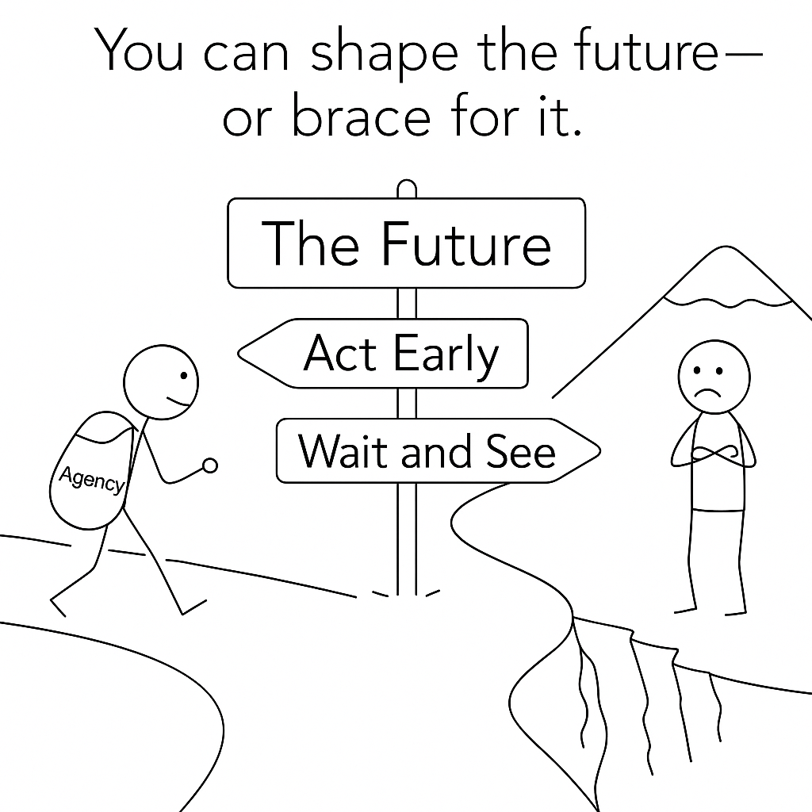

# V. The Prep Window

<figure><figcaption></figcaption></figure>

**If prep costs pennies but failure could cost everything, why wait? From a game-theoretic view, early AGI prep is the dominant strategy. The core logic is Pascal's wager: preparing early costs little; being unprepared could be catastrophic. Societies often sleepwalk into predictable crises—as evidenced by COVID-19. With AGI, the stakes are existential. Uncertainty demands preparation, not inaction.**

<strong>Table of Contents</strong>

[The storm's coming](v.-the-prep-window.md#the-storms-coming)

[1 The one-way gamble](v.-the-prep-window.md#id-1-the-one-way-gamble)

[2 Asleep at the edge](v.-the-prep-window.md#id-1-the-one-way-gamble)

[3 The only certainty is uncertainty](v.-the-prep-window.md#id-3-the-only-certainty-is-uncertainty)

[Preparation](v.-the-prep-window.md#preparation)

> _The art of war teaches us to rely not on the likelihood of the enemy's not coming, but on our own readiness to receive him; not on the chance of his not attacking, but rather on the fact that we have made our position unassailable._
>
> **— Sun Tzu**\
> \
> &#xNAN;_&#x54;o be prepared for war is one of the most effective means of preserving peace._
>
> **— George Washington**

_If you’re enjoying this deep dive and want to keep up to date with my future writing projects and ideas,_ [_subscribe here_](https://alexbrogan.substack.com/subscribe)_._&#x20;

***

## The storm's coming

<figure><figcaption>
It's time to pay attention.
</figcaption></figure>

Humans show a remarkable capacity to recognize approaching danger while simultaneously failing to act on that knowledge. This pattern emerges from a complex interplay of structural and psychological factors: the tragedy of commons in distributed responsibility, short-term political and corporate incentives, and our natural discomfort with contemplating existential threats.

Throughout history, we've consistently assumed "someone else" will handle looming crises—from ancient wars to modern pandemics. Yet with artificial general intelligence (AGI), this tendency toward collective abdication faces its most consequential test. Unlike previous technologies that developed through visible, gradual stages, AGI follows an exponential progression that might compress decades of advancement into months once certain thresholds are crossed.

The wisdom of strategy teaches us a simple truth: if you want to survive a storm, you don't wait until lightning strikes. You prepare while the sky is still blue. With AGI, we're still under mostly blue skies, but [clouds are gathering](https://situational-awareness.ai/) on the horizon—and [history suggests](#user-content-fn-1)[^1] they move faster than people expect. AI could be the [fastest storm](https://www.youtube.com/watch?v=wrESBnPYoZU) of them all.

The most important lesson from strategy, finance, and even good old common sense: it's never enough to merely bet that disaster won't happen. You must build a position strong enough to survive if it does.

## **1** The one-way gamble

<figure><figcaption></figcaption></figure>

[Pascal’s wager](https://en.wikipedia.org/wiki/Pascal's_wager) is one of the oldest arguments for why it’s rational to prepare for uncertain but high-stakes events. The original version was about God. Blaise Pascal, the seventeenth-century philosopher and mathematician, argued that you should live as if God exists, because if you're wrong, you lose a little — but if you're right, you gain everything. In his words: if God doesn't exist, you lose only finite pleasures. But if He does, you gain eternity — and [avoid eternal loss](#user-content-fn-2)[^2].

> _Pascal contends that a rational person should adopt a lifestyle consistent with the existence of God and actively strive to believe in God._ \
> \
> _The reasoning behind this stance lies in the potential outcomes: if God does not exist, the individual incurs only finite losses, potentially sacrificing certain pleasures and luxuries._ \
> \
> _However, if God does indeed exist, they stand to gain immeasurably, as represented for example by an eternity in Heaven in Abrahamic tradition, while simultaneously avoiding boundless losses associated with an eternity in Hell._

It’s not a perfect argument for questions of faith — people like [Richard Dawkins](https://www.goodreads.com/book/show/14743.The_God_Delusion) have pointed out the problems. But it’s still a [useful way](#user-content-fn-3)[^3] to think about risks where the downside is massive and the upside of preparation is much larger than the cost.

You see this logic in action with climate change. Even if you thought there was only a 1% chance it’s real, the scale of possible disaster means you have to take it seriously. Not preparing [is bad math](#user-content-fn-4)[^4].

The same thing happened with COVID-19. If you were willing to entertain the possibility early — even if you weren’t sure — you could take simple steps to protect your family, move if needed, stock up, or avoid getting trapped somewhere bad. You didn’t have to be certain to act. And acting preserved your agency [when the crisis hit](#user-content-fn-5)[^5].

If you ignored the possibility altogether, you lost your ability to choose. You ended up at the mercy of the system around you. It’s the same with AGI. We can’t know for sure if we’ll get it in five years. But if we do, the world will change faster than anything we’ve ever seen. The real question is simple: _If that future comes, do you want to be prepared — or caught flat-footed?_

<figure><figcaption></figcaption></figure>

## **2** Asleep at the edge

<figure><figcaption>
Learn the lessons.
</figcaption></figure>

> _Fool me once, shame on you; fool me twice, shame on me._
>
> **— Anthony Welden**

One reason I take AGI seriously—and on a short timeline—is because history repeats. Our collective capacity for self-deception in the face of visible catastrophe is a persistent feature of history. Just ask Winston Churchill. [He warned](https://www.raabcollection.com/foreign-figures-autographs/churchill-june-5-1938) of the threat of Hitler ad nauseam before he was taken seriously and eventually awarded the prime minister role—luckily, it wasn't too late.

Consider how almost everyone sleepwalked into COVID-19, despite clear warnings. You might argue the [death toll](https://www.worldometers.info/coronavirus/) wasn't catastrophic compared to historical plagues, but that was more fortune than foresight. And AGI, if it goes wrong, won't just affect some people—it will touch everything and everyone.

The pandemic provides direct evidence that even when risks are obvious and experts are raising alarms, most of the world stays focused on daily concerns while ignoring the looming crisis. The warnings were there, [accumulating over years](#user-content-fn-6)[^6]:

In 2015, [Bill Gates warned](https://www.cbsnews.com/news/coronavirus-bill-gates-epidemic-warning-readiness/) in his TED Talk that our next catastrophe would likely be a virus, not war, and that our response systems were inadequate. By 2017, epidemiologist [Michael Osterholm had published](https://www.cidrap.umn.edu/public-health/osterholm-plays-detective-general-deadliest-enemy-book) Deadliest Enemy, declaring a pandemic inevitable and outlining preparation plans that governments largely ignored. That same year, [Jeremy Konyndyk predicted](https://www.politico.com/magazine/story/2017/03/donald-trump-master-of-disaster-214848/) in Politico that U.S. neglect of health emergency systems would lead to disaster. By 2018, [Ed Yong wrote plainly](https://www.theatlantic.com/magazine/archive/2018/07/when-the-next-plague-hits/561734/) in The Atlantic that global travel, urbanization, and weak health systems made a deadly pandemic inevitable, stating "much worse is coming." Most telling, just months before COVID-19 struck, the [Johns Hopkins Center for Health Security reported](https://centerforhealthsecurity.org/2019/inaugural-global-health-security-index-finds-no-country-is-prepared-for-epidemics-or-pandemics-even-high-income-countries-are-found-lacking-and-score) that not a single country—not even the wealthiest—was fully prepared for a pandemic.

And yet when the pandemic arrived, almost no one was ready.

If that's how the world reacts to a threat it can see coming, what makes us think it will be different with AGI? The pattern seems disturbingly consistent: experts warn, institutions acknowledge but fail to act, and preparation remains theoretical until crisis forces a response.

This time, [even more voices are sounding the alarm](https://open.substack.com/pub/alexbrogan/p/the-intelligence-landing-is-near?r=f8mdu\&utm_campaign=post\&utm_medium=web\&showWelcomeOnShare=true) about artificial intelligence. This time, we've been warned. The question is: have we learned to listen?

## 3 The only certainty is uncertainty

<figure><figcaption>
The sources of uncertainty mean preparation is paramount.
</figcaption></figure>

[Our previous analysis](ii.-the-countdown.md#bull-or-bear) suggests three possible timelines: AGI around 2030 appears most plausible; timelines beyond five years remain moderately plausible; while development within the next five years seems least plausible, though we can't dismiss it entirely.

The uncertainty stems from three opposing forces:&#x20;

1. [_Recursive Self-Improvement_](#user-content-fn-7)[^7]_._ AI designing better AI could accelerate progress unpredictably, shortening timelines.
2. [_Constraints_](#user-content-fn-8)[^8]_._ New bottlenecks (e.g., energy, data quality) might emerge, lengthening timelines.
3. [_Emergence_](#user-content-fn-9)[^9]_._ Scaling could unlock sudden capabilities, shortening timelines.

These forces push in opposite directions. And no one knows which will dominate.

You can't prove we’ll get AGI in five years. You can't prove we won’t. You can't even prove it [won’t happen next year](#user-content-fn-10)[^10]. In investing, when you face that kind of uncertainty, you don’t just guess better — you build a [_margin of safety_](#user-content-fn-11)[^11]. [You prepare for things to go wrong](#user-content-fn-12)[^12], even if you hope they won't. That’s how you survive.

It was true in 2008 when bad forecasts sank entire companies. It will be true again with AGI. The difference between survival and disaster won’t be prediction accuracy. It will be preparation.

You don’t have to know exactly when the future will arrive. You just have to be ready when it does.

## Preparation

<figure><figcaption></figcaption></figure>

The future isn't something that happens _to_ you. It's something you either shape or get shaped by. We don't know exactly when AGI will arrive, or exactly what it will look like. But uncertainty isn't a reason to do nothing. It's the best reason to act.

When things change this fast, the cost of being unprepared is measured not just in money or opportunity, but in agency — in whether you're someone who gets to make choices, or someone who just has to live with them.

So the question isn’t, _"Will this happen soon enough to matter?"_ The question is, _"When it does, what position do I want to be in?"_ The smartest way to prepare for an uncertain future is to start early.

#### Coming up next: _Which specific moves flip uncertainty into advantage during the transition?_ 



***

#### Want me to send you new ideas?

If you’re enjoying this deep dive and want to keep up to date with my future writing projects and ideas, subscribe here:



***

## Footnotes

#### 1

One of AI's founders thinks we're building the equivalent of nuclear reactors without control rods. [Russell's warning](https://www.penguinrandomhouse.com/books/566677/human-compatible-by-stuart-russell/) comes after 40 years advancing the very field he now fears.

#### 2

[Found posthumously](https://plato.stanford.edu/entries/pascal-wager/) in his papers. The probability pioneer died at 39.

#### 3

Dawkins meant to demolish Pascal's wager but accidentally strengthened its application to extinction risks. [His book](https://www.goodreads.com/book/show/14743.The_God_Delusion) raises the perfect question for AI alignment. why would a superintelligence value what humans value?

#### 4

Standard economic models can't handle genuine uncertainty. [Weitzman showed](https://www.mitpressjournals.org/doi/abs/10.1162/rest.91.1.1) that unlikely but extreme outcomes should dominate our calculations—we've been drastically underestimating climate risks.

#### 5

The trader who made millions betting against conventional wisdom. Systems that gain from disorder—what [Taleb calls](https://www.edge.org/conversation/nassim_nicholas_taleb-the-fourth-quadrant-a-map-of-the-limits-of-statistics) "antifragile"—might be our best defense against unpredictable catastrophes.

#### 6

Seventeen years. That's how long we had to prepare for COVID after the first detailed warnings. [This compilation](https://www.genengnews.com/topics/coronavirus/blinking-red-25-missed-pandemic-warning-signs/) documents 25 specific pandemic alerts experts ignored—including Bill Gates' now-famous 2015 TED talk.

#### 7

The AI equivalent of compound interest—systems improving themselves, creating better systems, which improve themselves further. [Bostrom coined](https://global.oup.com/academic/product/superintelligence-9780199678112) "recursive self-improvement" to describe this potentially explosive feedback loop.

#### 8

After two years analyzing AI progress at Open Philanthropy, Cotra gives a 10% chance of AGI by 2025 and a median estimate of 2040. [Her forecast model](https://www.alignmentforum.org/posts/KrJfoZzpSDpnrv9va/draft-report-on-ai-timelines) remains the most comprehensive available.

#### 9

Neural networks suddenly "getting it" after appearing to merely memorize data. [This phenomenon](https://www.alignmentforum.org/posts/N6WM6hs7RQMKDhYjB/mechanistic-interpretability-grokking-and-scaling-laws), called "grokking," might be the most important AI behavior you've never heard of.

#### 10

Either we go extinct soon, colonize the stars, or live in a simulation—there are no boring futures left according to [Karnofsky's analysis](https://www.cold-takes.com/all-possible-views-about-humanitys-future-are-wild/).

#### 11

The principle that made Warren Buffett the world's greatest investor. you don't need to know something's exact value—just that it's worth significantly more than you're paying. [Graham's approach](https://www.harpercollins.com/products/the-intelligent-investor-rev-ed-benjamin-graham), applied to existential risks, means preparing for worst-case scenarios even without precise probabilities.

#### 12

We're wired to ignore low-probability, high-impact events until they happen. [Taleb predicted](https://www.penguinrandomhouse.com/books/176226/the-black-swan-second-edition-by-nassim-nicholas-taleb/) the 2008 crash using this insight about human blindspots.

[^1]: [1](https://www.thelastinvention.ai/v.-the-prep-window#id-1) One of AI's founders thinks we're building the equivalent of nuclear reactors without control rods. [Russell's warning](https://www.penguinrandomhouse.com/books/566677/human-compatible-by-stuart-russell/) comes after 40 years advancing the very field he now fears.

[^2]: [#id-2](v.-the-prep-window.md#id-2 "mention") [Found posthumously](https://plato.stanford.edu/entries/pascal-wager/) in his papers. The probability pioneer died at 39.

[^3]: [#id-3](v.-the-prep-window.md#id-3 "mention") Dawkins meant to demolish Pascal's wager but accidentally strengthened its application to extinction risks. [His book](https://www.goodreads.com/book/show/14743.The_God_Delusion) raises the perfect question for AI alignment. why would a superintelligence value what humans value?

[^4]: [#id-4](v.-the-prep-window.md#id-4 "mention") Standard economic models can't handle genuine uncertainty. [Weitzman showed](https://www.mitpressjournals.org/doi/abs/10.1162/rest.91.1.1) that unlikely but extreme outcomes should dominate our calculations—we've been drastically underestimating climate risks.

[^5]: [#id-5](v.-the-prep-window.md#id-5 "mention") Systems that gain from disorder—what [Taleb calls](https://www.edge.org/conversation/nassim_nicholas_taleb-the-fourth-quadrant-a-map-of-the-limits-of-statistics) "antifragile"—might be our best defense against unpredictable catastrophes.

[^6]: [#id-6](v.-the-prep-window.md#id-6 "mention") Seventeen years. That's how long we had to prepare for COVID after the first detailed warnings. [This compilation](https://www.genengnews.com/topics/coronavirus/blinking-red-25-missed-pandemic-warning-signs/) documents 25 specific pandemic alerts experts ignored—including Bill Gates' now-famous 2015 TED talk.

[^7]: [#id-7](v.-the-prep-window.md#id-7 "mention") The AI equivalent of compound interest—systems improving themselves, creating better systems, which improve themselves further. [Bostrom coined](https://global.oup.com/academic/product/superintelligence-9780199678112) "recursive self-improvement" to describe this potentially explosive feedback loop.

[^8]: [#id-8](v.-the-prep-window.md#id-8 "mention") After two years analyzing AI progress at Open Philanthropy, Cotra gives a 10% chance of AGI by 2025 and a median estimate of 2040. [Her forecast model](https://www.alignmentforum.org/posts/KrJfoZzpSDpnrv9va/draft-report-on-ai-timelines) remains the most comprehensive available.

[^9]: [#id-9](v.-the-prep-window.md#id-9 "mention") Neural networks suddenly "getting it" after appearing to merely memorize data. [This phenomenon](https://www.alignmentforum.org/posts/N6WM6hs7RQMKDhYjB/mechanistic-interpretability-grokking-and-scaling-laws), called "grokking," might be the most important AI behavior you've never heard of.

[^10]: [#id-10](v.-the-prep-window.md#id-10 "mention") Either we go extinct soon, colonize the stars, or live in a simulation—there are no boring futures left according to [Karnofsky's analysis](https://www.cold-takes.com/all-possible-views-about-humanitys-future-are-wild/).

[^11]: [#id-11](v.-the-prep-window.md#id-11 "mention") The principle that made Warren Buffett the world's greatest investor. you don't need to know something's exact value—just that it's worth significantly more than you're paying. [Graham's approach](https://www.harpercollins.com/products/the-intelligent-investor-rev-ed-benjamin-graham), applied to existential risks, means preparing for worst-case scenarios even without precise probabilities.

[^12]: [#id-12](v.-the-prep-window.md#id-12 "mention") We're wired to ignore low-probability, high-impact events until they happen. [Taleb predicted](https://www.penguinrandomhouse.com/books/176226/the-black-swan-second-edition-by-nassim-nicholas-taleb/) the 2008 crash using this insight about human blindspots.
